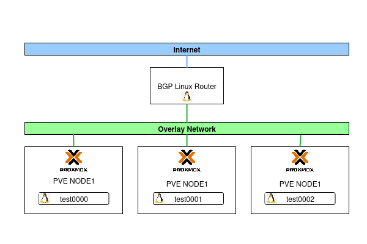
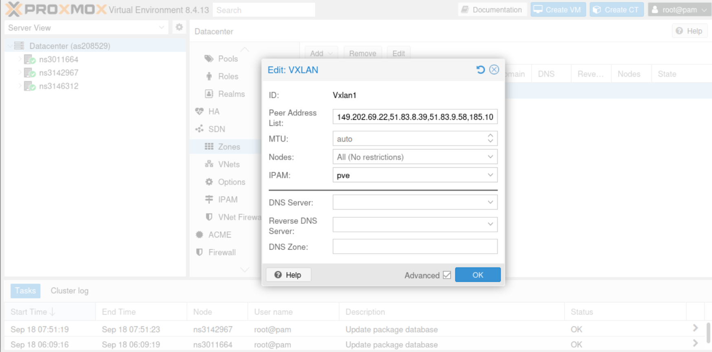
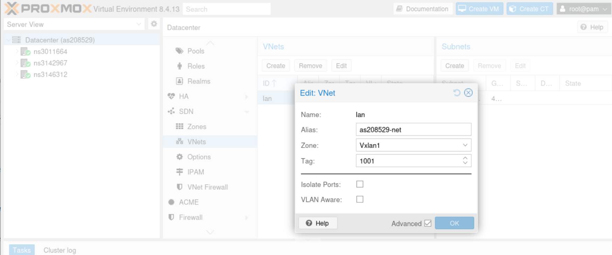
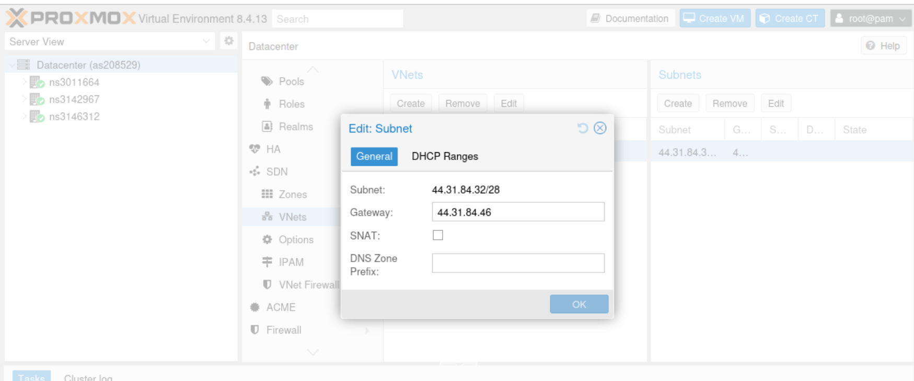
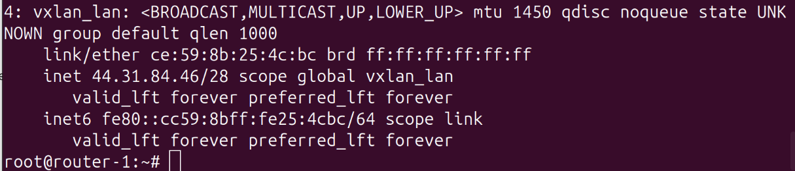
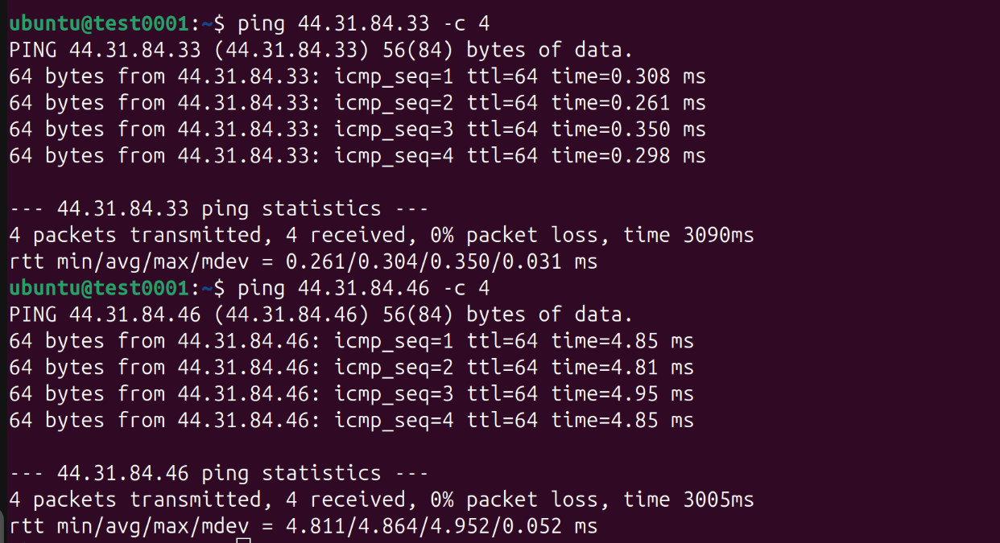
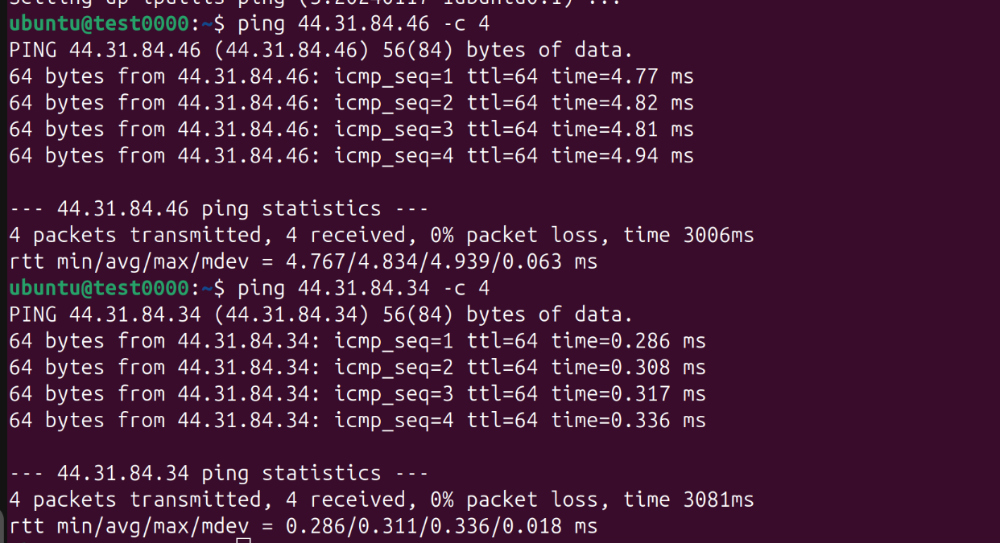

# Overlay Network Deployment with Proxmox SDN (Proxmox 8)

## Introduction
In this project, I deployed an overlay network using **Proxmox Virtual Environment 8 (PVE 8)** with the integrated **Datacenter SDN (Software Defined Networking)**.  
The goal was to use my own Public IPv4 and IPv6 on vms hosted on public cloud.

---

## Objectives
- Implement a **VXLAN-based overlay network** using Proxmox SDN.   
- Integrate networking into **Proxmox Datacenter SDN menus** for easier management.  
- Validate connectivity across nodes and virtual machines.  
- Expose VMs on Internet via public IPs
---

## Architecture
### Components
- **Proxmox VE 8** cluster (3 nodes)  
- **Datacenter SDN** enabled  
- **Linux router** for the gateway 

### Diagram

<div>
  <center><center/>
</div>
---

## Deployment Steps
### 1. Enable SDN in Datacenter
- Navigate to **Datacenter → SDN**.  
- Create a **Zone** with type `vxlan`.  
- Configure **MTU, bridge, and VNI (VXLAN Network Identifier)**. 
- Add all ipv4 peer address **Peer Address**. 

<div>
  <center><center/>
</div>


### 2. Create Virtual Networks
- Add **VNets** (virtual networks) inside the SDN zone.  
- Assign **VXLAN IDs** to each network (e.g., `vnet10`, `vnet20`).  

<div>
  <center><center/>
</div>

<div>
  <center><center/>
</div>

### 3. Apply SDN Configuration
- Navigate to **Datacenter → SDN** and apply
---
### 4. Create Vxlan on Linux router

```
# enable vxlan on kernet
sudo modprobe vxlan

#ifupdown2 is a modern drop-in replacement

apt install ifupdown2

#/etc/network/interfaces.d/sdn
auto vxlan_lan
iface vxlan_lan inet manual
    address 44.31.84.46/28
    vxlan-id 1001
    vxlan_localip 185.10.17.*  # Router public ip
    vxlan_svcnodeip 51.83.8.*  # PVE node1 public ip
    vxlan_svcnodeip 51.83.9.*  # PVE node2 public ip
    vxlan_svcnodeip 149.202.69.*  # PVE node3 public ip
    mtu 1450


# add the line at the end of the file /etc/network/interfaces
source /etc/network/interfaces.d/sdn
```

<div>
  <center><center/>
</div>


---

## Validation
I deployed three virtual machines (test0000, test0001, and test0002) across different Proxmox VE nodes and connected them to the overlay network I implemented. The overlay network is fully operational, and each VM has been assigned a public IP, making them directly accessible from the internet. This demonstrates the successful deployment of a scalable, multi-node overlay network using Proxmox SDN.

<div>
  <center><center/>
</div>

<div>
  <center><center/>
</div>